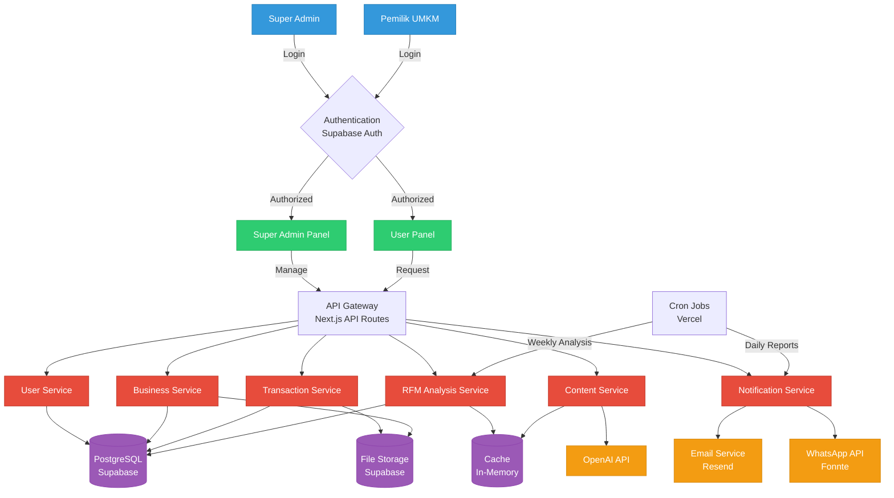

# Arsitektur Interaksi Sistem Dengan Pengguna

## 1. DIAGRAM ARSITEKTUR INTERAKSI



## 2. DETAIL INTERAKSI PER ROLE

### A. SUPER ADMIN INTERACTIONS

```
┌─────────────────────────────────────────────────────────────┐
│                    SUPER ADMIN WORKFLOWS                     │
├─────────────────────────────────────────────────────────────┤
│                                                             │
│  1. USER MANAGEMENT                                         │
│     Super Admin ──► Auth ──► API ──► User Service ──► DB   │
│                                                             │
│  2. SYSTEM MONITORING                                       │
│     Super Admin ──► Dashboard ──► Analytics Service        │
│                           └──► API Usage Monitor            │
│                           └──► Error Logs                   │
│                                                             │
│  3. CONFIGURATION                                           │
│     Super Admin ──► Settings ──► Config Service ──► DB     │
│                                                             │
│  4. REPORTS                                                 │
│     Super Admin ──► Reports ──► Report Service             │
│                           └──► PDF Generator                │
│                           └──► Email Service                │
└─────────────────────────────────────────────────────────────┘
```

### B. PEMILIK UMKM INTERACTIONS

```
┌─────────────────────────────────────────────────────────────┐
│                  PEMILIK UMKM WORKFLOWS                      │
├─────────────────────────────────────────────────────────────┤
│                                                             │
│  1. DATA INPUT                                              │
│     User ──► Form ──► API ──► Transaction Service ──► DB   │
│            └──► Excel Upload ──► Parse ──► Bulk Insert     │
│                                                             │
│  2. RFM ANALYSIS                                            │
│     User ──► Dashboard ──► RFM Service                     │
│                      └──► Cache Check                       │
│                      └──► Calculate if needed               │
│                      └──► Display Results                   │
│                                                             │
│  3. CONTENT GENERATION                                      │
│     User ──► Select Segment ──► Content Service            │
│                           └──► OpenAI API                   │
│                           └──► Return Content               │
│                           └──► Save to Cache                │
│                                                             │
│  4. NOTIFICATIONS                                           │
│     System ──► Cron Job ──► Check Updates                  │
│                        └──► Email/WhatsApp                  │
│                        └──► User Dashboard Alert            │
└─────────────────────────────────────────────────────────────┘
```

## 3. API ENDPOINTS ARCHITECTURE

### Authentication Endpoints
```typescript
POST   /api/auth/login          // Login user
POST   /api/auth/logout         // Logout user
POST   /api/auth/refresh        // Refresh token
POST   /api/auth/forgot         // Forgot password
POST   /api/auth/reset          // Reset password
```

### Super Admin Endpoints
```typescript
// User Management
GET    /api/admin/users         // List all users
POST   /api/admin/users         // Create new user
PUT    /api/admin/users/:id     // Update user
DELETE /api/admin/users/:id     // Delete user
POST   /api/admin/users/:id/suspend  // Suspend user

// System Management
GET    /api/admin/analytics     // System analytics
GET    /api/admin/api-usage     // API usage stats
GET    /api/admin/logs          // System logs
PUT    /api/admin/settings      // Update settings

// Reports
GET    /api/admin/reports/platform   // Platform report
GET    /api/admin/reports/revenue    // Revenue report
GET    /api/admin/reports/usage      // Usage report
```

### Pemilik UMKM Endpoints
```typescript
// Customer Management
GET    /api/customers           // List customers
POST   /api/customers           // Add customer
PUT    /api/customers/:id       // Update customer
DELETE /api/customers/:id       // Delete customer
POST   /api/customers/import    // Import customers

// Transaction Management
GET    /api/transactions        // List transactions
POST   /api/transactions        // Add transaction
PUT    /api/transactions/:id    // Update transaction
DELETE /api/transactions/:id    // Delete transaction
POST   /api/transactions/import // Import transactions

// RFM Analysis
GET    /api/rfm/analysis        // Get RFM analysis
POST   /api/rfm/calculate       // Trigger calculation
GET    /api/rfm/segments        // Get segments detail

// Content Generation
POST   /api/content/generate    // Generate content
GET    /api/content/templates   // Get saved templates
POST   /api/content/templates   // Save template

// Reports
GET    /api/reports/rfm         // RFM report
GET    /api/reports/customers   // Customer report
GET    /api/reports/revenue     // Revenue report
```

## 4. DATA FLOW ARCHITECTURE

### A. Authentication Flow
```
User Input Credentials
         │
         ▼
   Supabase Auth
         │
    ┌────┴────┐
    │ Valid?  │
    └────┬────┘
         │ Yes
         ▼
   Generate JWT
         │
         ▼
   Store Session
         │
         ▼
  Redirect to Dashboard
```

### B. RFM Analysis Flow
```
Transaction Data Input
         │
         ▼
   Validate Data
         │
         ▼
   Store in DB
         │
         ▼
   Trigger Analysis
         │
    ┌────┴────┐
    │ Cached? │
    └────┬────┘
         │ No
         ▼
  Calculate RFM Scores
         │
         ▼
  Segment Customers
         │
         ▼
   Store Results
         │
         ▼
   Update Cache
         │
         ▼
  Display Dashboard
```

### C. Content Generation Flow
```
Select Customer Segment
         │
         ▼
  Choose Content Type
         │
         ▼
  Check Cache First
         │
    ┌────┴────┐
    │ Found?  │
    └────┬────┘
         │ No
         ▼
  Build AI Prompt
         │
         ▼
  Call OpenAI API
         │
         ▼
  Process Response
         │
         ▼
   Cache Result
         │
         ▼
  Display Content
```

## 5. SECURITY LAYERS

### A. Authentication & Authorization
```
┌─────────────────────────────────────┐
│        Security Layers              │
├─────────────────────────────────────┤
│ 1. JWT Token Validation             │
│ 2. Role-Based Access Control        │
│ 3. Row Level Security (RLS)         │
│ 4. API Rate Limiting                │
│ 5. Input Validation (Zod)           │
│ 6. CORS Configuration               │
│ 7. SQL Injection Prevention         │
│ 8. XSS Protection                   │
└─────────────────────────────────────┘
```

### B. Access Control Matrix

| Feature | Super Admin | Pemilik UMKM |
|---------|------------|--------------|
| View All Users | ✅ | ❌ |
| Manage Users | ✅ | ❌ |
| View All UMKM Data | ✅ | ❌ |
| View Own Data | ✅ | ✅ |
| Manage Own Data | ✅ | ✅ |
| System Settings | ✅ | ❌ |
| API Management | ✅ | ❌ |
| Generate Content | ✅ | ✅ |
| View System Logs | ✅ | ❌ |
| Export Reports | ✅ | ✅ (Own only) |

## 6. REAL-TIME INTERACTIONS

### WebSocket Events (Future Enhancement)
```javascript
// Real-time notifications
socket.on('rfm-analysis-complete', (data) => {
  // Update dashboard
})

socket.on('new-transaction', (data) => {
  // Update statistics
})

socket.on('api-limit-warning', (data) => {
  // Show warning
})
```

## 7. ERROR HANDLING FLOW

```
User Action
    │
    ▼
API Request
    │
    ▼
Try Operation
    │
┌───┴───┐
│ Error?│
└───┬───┘
    │ Yes
    ▼
Log Error (Sentry)
    │
    ▼
Determine Error Type
    │
    ├── 400: Bad Request → Show validation error
    ├── 401: Unauthorized → Redirect to login
    ├── 403: Forbidden → Show permission error
    ├── 404: Not Found → Show not found page
    ├── 429: Rate Limited → Show rate limit message
    └── 500: Server Error → Show generic error
```

## 8. PERFORMANCE OPTIMIZATION

### Caching Strategy
```
┌────────────────────────────────┐
│      Caching Layers           │
├────────────────────────────────┤
│ 1. Browser Cache (Static)     │
│ 2. CDN Cache (Assets)         │
│ 3. API Response Cache         │
│ 4. Database Query Cache       │
│ 5. RFM Result Cache          │
│ 6. AI Content Cache          │
└────────────────────────────────┘
```

### Load Distribution
- Static assets: Vercel CDN
- API requests: Load balanced
- Database queries: Connection pooling
- Background jobs: Queue system